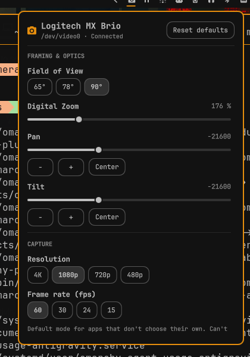

# abduldotdev.camera

Native `omarchy-shell` bar widget and settings popup providing Logi Tune-like controls on Linux. A camera-agnostic V4L2/UVC webcam controller for the capture devices the Linux kernel exposes, with the **Logitech MX Brio 4K Ultra HD webcam** (`046d:0944`) as the reference device: FOV, zoom, pan/tilt, focus, exposure, white balance, capture mode, and multi-camera switching.

## Screenshots



## Features

- **Bar Widget Integration**: Compact camera icon in the Omarchy bar displaying connection status (dimmed when no capture device is discovered).
- **Fast & Stateless**: Communicates with hardware via non-blocking asynchronous `v4l2-ctl` and `cameractrls` calls. Zero open video streams while closed; live viewfinder opens on demand strictly when the settings popup is open.
- **In-Popup Live Viewfinder**: On-demand 16:9 live video preview stream with strict V4L2 ownership lifecycle: opens the selected capture device only when the popup is visible, streams at the configured capture mode, and synchronously releases the device file descriptor immediately on close, re-applying the configured driver default so external conferencing apps are never locked out. Includes an atomic capture mode interlock (pausing preview across queued format mutations until Qt reports the camera inactive) and six explicit stream states: Active, Inactive, Busy (`EBUSY`), Permission Denied (`EACCES`), Disconnected, and Unavailable. Hardware controls remain fully responsive and non-blocking during preview errors.
- **Multi-Camera Selector**: A Camera selector sits under the header separator and above the viewfinder only when more than one capture device is discovered, labelled by card name, with the path appended when two cards share a name.
- **Right-Edge Vertical Scrollbar**: A visible, draggable right-edge vertical scrollbar (`ScrollBar.AsNeeded`) that appears when content overflows, supporting click-and-drag handle scrubbing, track clicking, and mouse-wheel scrolling when hovered.
- **Wheel-Safe Control Isolation**: Scrolling the mouse wheel anywhere over the popup content scrolls the settings list and never modifies any slider value. Sliders change strictly by dragging or clicking the knob/track, pressing step buttons, or via IPC commands.
- **Dynamic Categorized Settings Popup**: Each settings row is shown only when the active camera exposes that control; slider min, max, and step come from the device; a section whose controls are all absent is omitted:
  - **Framing & Optics**: Hardware Field of View (FOV) selection (65°, 78°, 90° for cameras exposing `logitech_brio_fov`), Digital Zoom, and Pan & Tilt sliders with step buttons (using limits and step reported by the device).
  - **Capture Mode**: Resolution and frame rate selection to configure Linux kernel driver capture defaults on the selected device.
  - **Focus**: Continuous autofocus toggle and manual focus distance slider (active only when autofocus is off, with device-reported range and step).
  - **Exposure**: Auto-exposure mode toggle (resolving auto and manual modes dynamically from the device menu), manual exposure time slider (active only in manual mode, with device-reported range and step), low-light compensation (dynamic framerate), and sensor gain slider.
  - **Color & Image**: Auto white balance toggle, color temperature slider (with range and step reported by the device, active only when AWB is off), brightness, contrast, saturation, and sharpness sliders.
  - **Utilities**: Anti-flicker power line frequency selection (with menu labels from the driver, e.g. Disabled, 50 Hz, 60 Hz) and backlight compensation toggle.
- **Device-Aware Factory Reset**: One-click "Reset defaults" button restores the controls that camera reports, each to its reported default.
- **Graceful Disconnected View**: Displays a clear "Camera Disconnected" card ("No capture device found") and retry button when no capture device is connected.
- **Full IPC Support**: Control any setting, query active or available devices, or switch cameras via `omarchy-shell abduldotdev.camera <method> ...` from scripts, keybindings, or other shell tools.

## Prerequisites

Both packages are in the official Arch `extra` repository. The plugin never installs anything itself; install them with Omarchy's package helper before enabling the plugin:

- **`v4l-utils`** (`v4l2-ctl`): **Required**. Provides direct Linux kernel V4L2 ioctl control across discovered capture devices.
- **`cameractrls`**: **Optional**. Enables the Logitech vendor Extension Unit (XU) Field of View control (65°/78°/90°) on cameras that expose `logitech_brio_fov`. If it is not installed or the camera does not support FOV, the FOV section is omitted and every other control keeps working.

```bash
omarchy pkg add v4l-utils cameractrls
```

## Installation

Before installing, ensure required dependencies are installed (see [Prerequisites](#prerequisites)).

To install and enable the camera plugin (ID: `abduldotdev.camera`) directly using the Omarchy CLI:

```bash
omarchy plugin add https://github.com/abduldotdev/camera.git --enable
```

### Development (local checkout)

Clone the repository and symlink it into the Omarchy plugins directory; the shell picks up the bar widget automatically:

```bash
git clone https://github.com/abduldotdev/camera.git
ln -sfn "$PWD/camera" ~/.config/omarchy/plugins/abduldotdev.camera
```

## Uninstall / Remove

To remove the plugin from Omarchy:

```bash
omarchy plugin remove abduldotdev.camera
```

Removal leaves nothing behind. The plugin is stateless and does not write any configuration files, caches, or state to disk.

## Capture Mode (Resolution & Frame Rate)

The plugin allows viewing the active capture mode and configuring the driver's default capture resolution and frame rate on the selected capture device via `v4l2-ctl --set-fmt-video` and `--set-parm`.

### Behaviour & Limitations

- **Persistent Driver Default**: The configured capture mode persists in the `uvcvideo` kernel driver across process opens. It serves as the initial default for non-negotiating V4L2 tools and applications (e.g. `v4l2-ctl --stream-mmap`, `mpv` on the selected capture device without size arguments, or cameractrls preview). The in-popup live preview streams at the configured capture mode and automatically re-applies the driver default upon closing the popup so other applications continue to receive the user-configured resolution and frame rate.
- **Exclusive Streaming Lock (`EBUSY`)**: Capture format and frame rate cannot be modified while any process is streaming video from the selected capture device. Attempting to set resolution or framerate while streaming returns `EBUSY` (`Device or resource busy`), and the popup indicates that the camera is currently in use.
- **Negotiating Applications Override Mode**: Video conferencing applications, browsers, and streaming pipelines (such as Google Meet, Zoom, OBS Studio, ffmpeg, GStreamer, and PipeWire camera portal clients) negotiate their own resolution and framerate per stream upon opening the device. The plugin's default does not constrain negotiating apps; however, the popup actively displays whatever mode the streaming app negotiated.
- **USB Link Speed & 4K Availability**: 4K resolution (3840×2160) requires a USB 3 link. Over a USB 2.0 link (480 Mbps), the camera hardware enumerates modes up to 1920×1080 @ 30 fps or 1600×896 @ 60 fps in MJPG.

## Controls Inventory

The table below documents the Logitech MX Brio reference inventory across its 18 supported controls. A connected camera shows only the rows it exposes, using that camera's own min, max, step, default, and menu items:

| Category | Control Name | Type | Range / Options | Default | Backend | Notes |
|---|---|---|---|---|---|---|
| **Framing & Optics** | `logitech_brio_fov` | Menu | 65°, 78°, 90° | 65° | `cameractrls` | Logitech vendor XU control. Hidden if `cameractrls` absent. |
| | `zoom_absolute` | Integer | 100 .. 400 | 100 | `v4l2-ctl` | Digital zoom (100 = 1x, 400 = 4x). |
| | `pan_absolute` | Integer | -72000 .. 72000 | 0 | `v4l2-ctl` | Stepping: 3600. Active during digital crop/zoom. |
| | `tilt_absolute` | Integer | -72000 .. 72000 | 0 | `v4l2-ctl` | Stepping: 3600. Active during digital crop/zoom. |
| **Focus** | `focus_automatic_continuous` | Boolean | 0 (Off), 1 (On) | 1 | `v4l2-ctl` | Continuous autofocus toggle. |
| | `focus_absolute` | Integer | 0 .. 255 | 0 | `v4l2-ctl` | Manual focus distance. Disabled when autofocus is enabled. |
| **Exposure** | `auto_exposure` | Menu | 1 (Manual), 3 (Auto) | 3 | `v4l2-ctl` | 3 = Aperture Priority (Auto), 1 = Manual Mode. |
| | `exposure_time_absolute` | Integer | 3 .. 2047 | 156 | `v4l2-ctl` | Manual exposure time (100 µs units). Disabled when auto-exposure is on. |
| | `exposure_dynamic_framerate` | Boolean | 0 (Off), 1 (On) | 0 | `v4l2-ctl` | Allows camera to reduce framerate in low-light environments. |
| | `gain` | Integer | 0 .. 255 | 0 | `v4l2-ctl` | Sensor analogue/digital gain (ISO sensitivity). |
| **Color & Image** | `white_balance_automatic` | Boolean | 0 (Off), 1 (On) | 1 | `v4l2-ctl` | Auto white balance toggle. |
| | `white_balance_temperature` | Integer | 2800 .. 7500 | 5000 | `v4l2-ctl` | Color temperature in Kelvin. Disabled when auto white balance is on. |
| | `brightness` | Integer | 0 .. 255 | 128 | `v4l2-ctl` | Image brightness offset. |
| | `contrast` | Integer | 0 .. 255 | 128 | `v4l2-ctl` | Image contrast curve. |
| | `saturation` | Integer | 0 .. 255 | 128 | `v4l2-ctl` | Image chroma saturation. |
| | `sharpness` | Integer | 0 .. 255 | 128 | `v4l2-ctl` | Image edge sharpness filtering. |
| **Utilities** | `power_line_frequency` | Menu | 0 (Off), 1 (50 Hz), 2 (60 Hz) | 2 (60 Hz) | `v4l2-ctl` | Anti-flicker filter matching local AC mains power frequency. |
| | `backlight_compensation` | Integer | 0 (Off), 1 (On) | 1 | `v4l2-ctl` | Backlight shadow reduction. |

## Logi Tune Feature Support on Linux

FOV is the MX Brio vendor control, and the other rows apply when the active camera exposes the matching V4L2 control.

| Feature | Supported? | Status & Technical Explanation |
|---|---|---|
| **Field of View (FOV: 65°/78°/90°)** | **Yes** | Fully supported via Logitech UVC Extension Unit (XU) through `cameractrls`. |
| **Digital Zoom (1x–4x)** | **Yes** | Fully supported via standard UVC camera control `zoom_absolute`. |
| **Pan & Tilt** | **Yes** | Fully supported via standard UVC camera controls `pan_absolute` and `tilt_absolute`. |
| **Autofocus & Manual Focus** | **Yes** | Fully supported via standard UVC controls `focus_automatic_continuous` and `focus_absolute`. |
| **Auto Exposure & Manual Shutter** | **Yes** | Fully supported via standard UVC controls `auto_exposure` and `exposure_time_absolute`. |
| **Sensor Gain (ISO)** | **Yes** | Fully supported via standard UVC control `gain`. |
| **Auto White Balance & Temperature** | **Yes** | Fully supported via standard UVC controls `white_balance_automatic` and `white_balance_temperature`. |
| **Image Tuning (Brightness/Contrast/etc.)** | **Yes** | Fully supported via standard UVC controls `brightness`, `contrast`, `saturation`, `sharpness`. |
| **Anti-flicker (50/60 Hz)** | **Yes** | Fully supported via standard UVC control `power_line_frequency`. |
| **Factory Reset** | **Yes** | Fully supported by applying default hardware values. |
| **Resolution & Frame Rate** | **Partial** | Driver default resolution and frame rate can be configured when idle; apps that negotiate per-stream (browsers, Zoom, PipeWire) override it, and settings cannot be changed while streaming (EBUSY). 4K requires a USB 3 link. |
| **HDR (High Dynamic Range)** | **No** | **Impossible on Linux**. MX Brio HDR processing is controlled via closed-source vendor firmware commands not exposed to the Linux UVC driver or reverse-engineered in open-source tools. |
| **RightSight AI Auto-Framing** | **No** | **Impossible on Linux**. RightSight is a proprietary software neural network running on the host machine inside the Logi Tune app on macOS/Windows; it is not camera hardware. |
| **Show Mode (Desk Tracking)** | **No** | **Impossible on Linux**. Show Mode relies on proprietary host software running computer vision on the video feed to detect when the camera tilts down toward a desk. |
| **Logitech Firmware Updates** | **No** | **Impossible on Linux**. Logitech firmware distribution uses proprietary encrypted USB transport. MX Brio is not supported by `fwupd` / Linux Vendor Firmware Service (LVFS). |
| **Live Viewfinder (In-Popup)** | **Yes** | Supported on demand inside the settings popup with a safe V4L2 lifecycle: streams at the configured capture mode only while the popup is open, releases the selected capture device immediately on close, re-applies the configured capture mode driver default on close, interlocks with capture mode mutations to prevent `EBUSY`, and reports six distinct stream states (Active, Inactive, Busy, Permission Denied, Disconnected, Unavailable). Controls remain unblocked during stream errors. Continuous viewfinder in the bar remains omitted to prevent persistent camera locking. |

## IPC Interface Contract

The widget exposes an `IpcHandler` with target `"abduldotdev.camera"`. You can interact with it via `omarchy-shell`:

```bash
# Open the camera settings popup
omarchy-shell abduldotdev.camera open

# Close the camera settings popup
omarchy-shell abduldotdev.camera close

# Toggle the camera settings popup
omarchy-shell abduldotdev.camera toggle

# Reset all camera controls to factory defaults
omarchy-shell abduldotdev.camera resetDefaults

# Query the current value of a control
omarchy-shell abduldotdev.camera getCtrl brightness
# Output: 128

omarchy-shell abduldotdev.camera getCtrl logitech_brio_fov
# Output: 65

# Set a control value
omarchy-shell abduldotdev.camera setCtrl brightness 150
omarchy-shell abduldotdev.camera setCtrl white_balance_automatic 0
omarchy-shell abduldotdev.camera setCtrl white_balance_temperature 4500
omarchy-shell abduldotdev.camera setCtrl logitech_brio_fov 78

# Query current capture mode (resolution, fps, pixelformat)
omarchy-shell abduldotdev.camera getCaptureMode
# Output: 1280x720@30 MJPG

# Set capture mode (resolution WxH, and optional fps)
omarchy-shell abduldotdev.camera setCaptureMode 1920x1080 30
omarchy-shell abduldotdev.camera setCaptureMode 1280x720 60

# Query the active capture device path
omarchy-shell abduldotdev.camera getDevice

# Switch to a discovered capture device path
omarchy-shell abduldotdev.camera setDevice /dev/video2

# List discovered capture devices as a JSON array of {path, name} objects
omarchy-shell abduldotdev.camera listDevices
```

## Testing

The plugin includes two test suites located in `tests/`:

1. **Model & Parser Unit Tests** (offline):
   Validates V4L2 and cameractrls CLI output parsing, control metadata definitions, command builders, dependency rules, and factory defaults without requiring camera hardware. Also covers discovery parsing, the auto-exposure resolver, and a generic UVC fixture.
   ```bash
   node tests/model.test.js
   ```

2. **Live Hardware Verification Test** (discovers connected camera):
   Discovers the capture device, skips with exit 0 and `SKIP: no capture device found` when none is connected, and exercises only the controls that device exposes. For each exposed control, it records the current value, sets a different valid value within parsed device limits, asserts hardware state change, restores original settings, and verifies device-aware factory reset behaviour. It also performs a capture-mode round trip against the discovered device verifying video format enumeration, active mode querying, and resolution/framerate mutation and restoration (skipping cleanly if the device is busy).
   ```bash
   node tests/hardware.test.js
   ```

## License

MIT License. See [LICENSE](LICENSE) for details.
